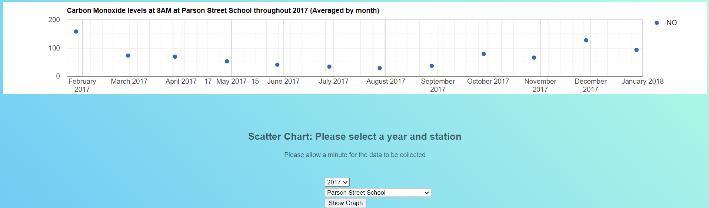
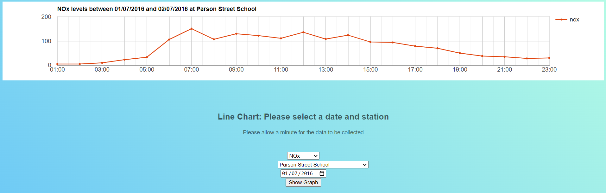
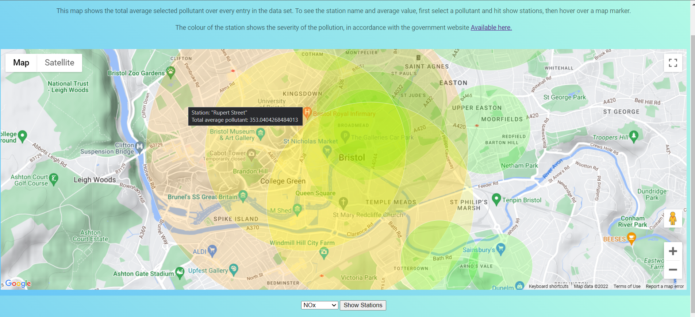

# UWE AITWD2 Assignment
### UFCFR5-15-3
Student No: 18017247
## XML Parsing
An XML parser as defined by [tutorialspoint](https://www.tutorialspoint.com/xml/xml_parsers.htm), is a software library or package that gives an interface allowing client applications to use XML documents.
### Streaming parsers
One commonly used type of parser is a stream parser. This type of parser streams its information one line at a time allowing for a continuous 'stream' of data, even with big data files. It does this by not worrying about the overall XML structure and only focussing on its current line of data. As such, context for the data being streamed is required externally (if required at all). 
 
These characteristics make it a very useful tool, but within limitations. One benefit of these parsers is its ability to handle extremely large data files. While most XML files will be large data files, it makes more sense to use a stream parser on extra large files because of its speed and line by line approach, making it ideal for large data files. One limitation of  stream parser is its inability to reverse, and r-read data that has already been read. This would require storing the information externally, taking up precious memory. Because of this, stream parsers are not ideal for tasks which require a lot of re-reading of files. Another limitation is that stream parsers are too complex to implement if the XML data file is irregular. This is because stream parsers are designed to access simple structured data files and are focussed on the information rather than file structure.
[Paul Shved (2011)](http://coldattic.info/post/55/)  
 
Examples of XML stream parsers could be `XMLReader` and `XMLWriter`.

### DOM parsers
Another common XML parser is a DOM parser. This parser is the officially recommended parser by the W3C (World Wide Web Consortium). With a DOM parser you receive a tree like structure of the XML document, containing all its elements and its structure. This differs to the stream parser in many key ways. 
 
As mentioned above, the key differences between DOM and stream parsers are its ability to re-read data, its knowledge of the data structure, its data structure manipulation ability. As you can imagine, these differences also mean that the DOM parser is significantly slower than the stream parser making it better suited to notably complex structures, and smaller data files. 
[tutorialspoint](https://www.tutorialspoint.com/java_xml/java_dom_parser.htm)  
 
An example of an XML DOM parser could be `SimpleXML`.
#### Summary
To summarise, these two methods of XML parsing described above, both methods have their own strengths and weaknesses. This means that it is not so much about them competing, but knowing when each parser would be suitable or more appropriate to use.
## Visual representations
To display the information given, a number of charts and maps were used. These were a scatter graph to show NO (Carbon Monoxide) levels in any one station over the course of any one year (at 8AM, averaged by month), a line graph to show any one pollutant over the course of any one day, and a map representation of total average of any one pollutant over each station.
### Scatter chart

The scatter chart shown above is created with a Google charts api. The data is averaged by month and displayed. While this chart does what it needs to do and works, the php script to get the required data could be optimized. Other improvements to this graph that could be made could be selecting individual pollutants to view, having the time of reading changeable or unset to see all data. Having the scatter points being colour coded to better show levels of pollution could also provide better visual information to the user.
### Line chart

The line chart shown above is created with a Google charts api. The data is then ordered and displayed. Similarly to the scatter graph the php script is yet to be optimized. As well as this, improvements such as showing multiple stations in a comparison style would be beneficial to the user. Also, a line per pollutant would be useful information for the user to have. A colour coded line/ points would also better visualise pollutant levels. 
### Map

The map shown above is a map created with a Google Maps api. Given that this was an open-ended task, I decided to make a visualisation of pollution over all stations, over all records. This shows the hotspots for pollution based on the last 15 years of data. to improve this visualisation I would suggest adding a time period to customise when the average values are taken. Also, a better scaling system for the sizes of the station markers, at the moment this is based on the amount of pollution produced at each station.
#### Summary
overall the visualisation implemented in this project is successful but could be improved, as suggested in the above sections.
## Evaluation
this project has been a successful venture into web development. Looking at the learning outcomes for this assignment, I have learnt to model & normalize substantial real-world big data through the extraction and normalization of the original csv file to XML. I have gained lots of experience and knowledge with APIs and visual representations of real data through their use. My skills with PHP, XML, XPATH, Parsing, Js, and JSON have been built upon throughout this project. and finally this report has been successfully written in markdown format.
## References
tutorialspoint (no date) _XML - Parsers_. Available from: https://www.tutorialspoint.com/xml/xml_parsers.htm [Accessed 01 May 2022] 
tutorialspoint (no date) _Java DOM Parser - Overview_. Available from: https://www.tutorialspoint.com/java_xml/java_dom_parser.htm [Accessed 01 May 2022] 
Shved, P. (2011) _XML Stream Parsing: Overview_. Available from: http://coldattic.info/post/55/ [Accessed 01 May 2022] 